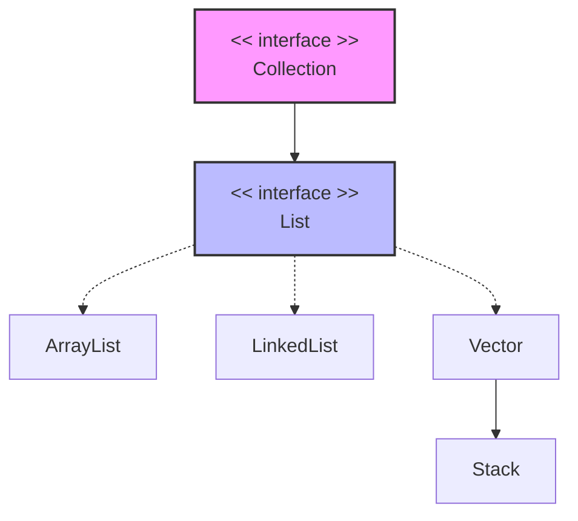
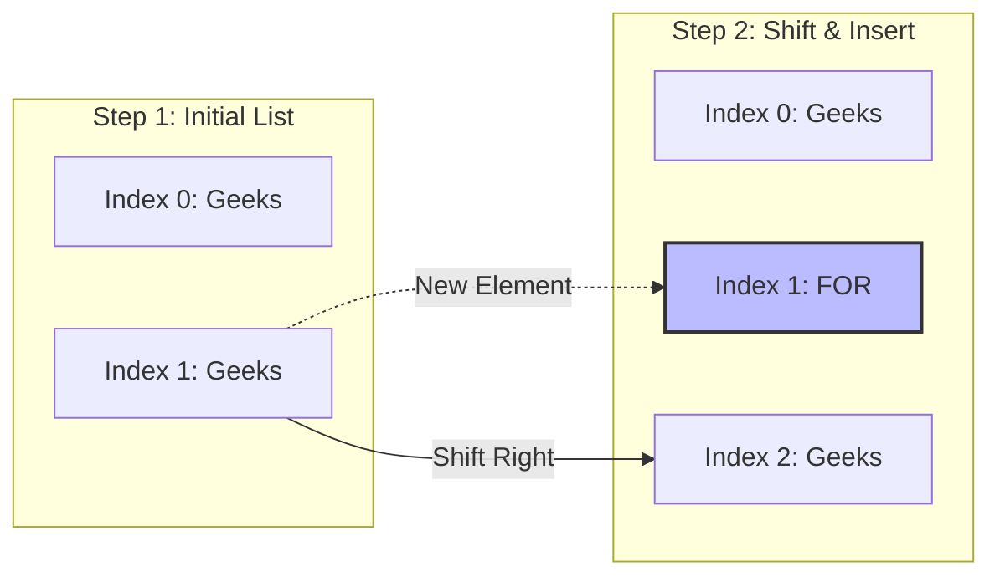

# Java List Interface Guide

The `List` interface in Java extends the `Collection` interface and is a core part of the `java.util` package. It represents an ordered collection (also known as a sequence) where duplicates are allowed and elements can be accessed precisely by their index.

---

## 1. Core Features
* **Insertion Order:** It maintains the exact order in which elements are inserted.
* **Duplicates Allowed:** It can store multiple identical elements.
* **Index-Based Access:** Elements can be retrieved, added, or updated using their positional index ($O(1)$ or $O(n)$ depending on the implementation).
* **Bidirectional Traversal:** Supports `ListIterator` to move both forward and backward through the collection.

---

## 2. Hierarchy & Implementations



* **ArrayList:** Implemented using a resizable array. Offers fast random access but slower insertions/deletions in the middle of the list.
* **LinkedList:** Implemented using a Doubly-linked list. Efficient for frequent insertions and deletions.
* **Vector:** A legacy, synchronized version of ArrayList that is thread-safe but slower.
* **Stack:** A subclass of Vector implementing standard LIFO (Last-In-First-Out) operations.

---

## 3. Method Complexities

| Operation | Time Complexity | Space Complexity |
| --- | --- | --- |
| **Adding Element** | $O(1)$ | $O(1)$ |
| **Removing Element** | $O(n)$ | $O(1)$ |
| **Replacing Element** | $O(1)$ | $O(1)$ |
| **Traversing List** | $O(n)$ | $O(1)$ |

---

## 4. Basic Usage Example

```java
import java.util.*;

class Geeks {
    public static void main(String[] args) {
        // Creating a List of Strings using ArrayList
        List<String> li = new ArrayList<>();

        // Adding elements in List
        li.add("Java");
        li.add("Python");
        li.add("DSA");
        li.add("C++");

        System.out.println("Elements of List are:");

        // Iterating through the list using an enhanced for-loop
        for (String s : li) {
            System.out.println(s);
        }
    }
}

```

### Common Operations Quick Reference

* **Add:** `list.add("Element")` or `list.add(index, "Element")`
* **Update:** `list.set(index, "New Value")`
* **Remove:** `list.remove(index)` or `list.remove("Element")`
* **Access:** `list.get(index)`
* **Check Existence:** `list.contains("Element")`

---

## 5. List vs Set

| Feature | List | Set |
| --- | --- | --- |
| **Order** | Ordered sequence (Maintains insertion order) | Unordered sequence |
| **Duplicates** | Allows duplicate elements | Does not allow duplicates |
| **Null Elements** | Allows multiple `null` elements | Allows only a single `null` element |
| **Access Type** | Positional index-based access | No positional access |

> 💡 **Tip:** Always program to an interface rather than an implementation to ensure flexibility. For example, use `List<String> list = new ArrayList<>();` instead of `ArrayList<String> list = new ArrayList<>();`.

---

# Java List Interface Methods Reference

The `List` interface provides a rich set of methods to manage ordered collections. Beyond the operations inherited from the `Collection` interface, `List` introduces index-based operations, specialized search capabilities, and precise positional control.

---

## 1. Core Methods by Category

### 📥 Element Modification & Insertion
Methods used to insert, update, or remove elements from specific positions in the list.

| Method | Description | Time Complexity |
| :--- | :--- | :--- |
| `add(E element)` | Appends the specified element to the end of the list. | $O(1)$ |
| `add(int index, E element)` | Inserts the specified element at the specified position. Shifts subsequent elements to the right. | $O(n)$ |
| `addAll(Collection<? extends E> c)` | Appends all elements of the given collection to the end of the list. | $O(m)$ where $m$ is collection size |
| `addAll(int index, Collection<? extends E> c)` | Inserts all elements of the given collection starting at the specified index. | $O(n + m)$ |
| `set(int index, E element)` | Replaces the element at the specified index with the new element. Returns the replaced element. | $O(1)$ |
| `remove(int index)` | Removes the element at the specified index and shifts subsequent elements to the left. | $O(n)$ |
| `remove(Object o)` | Removes the first occurrence of the specified element from the list. | $O(n)$ |
| `clear()` | Removes all elements from the list, leaving it empty. | $O(n)$ |

---

## 2. Array Shifting Visualization
When using index-based insertions or removals like `add(int index, E element)`, the underlying system must shift elements to maintain sequential order:


---

### 🔍 Retrieval & Search Capabilities

Methods used to read data or look up indices based on value matching.

| Method | Description | Time Complexity |
| --- | --- | --- |
| `get(int index)` | Returns the element at the specified positional index. | $O(1)$ (ArrayList)<br>

<br>$O(n)$ (LinkedList) |
| `indexOf(Object o)` | Returns the index of the **first occurrence** of the specified element, or `-1` if absent. | $O(n)$ |
| `lastIndexOf(Object o)` | Returns the index of the **last occurrence** of the specified element, or `-1` if absent. | $O(n)$ |
| `contains(Object o)` | Returns `true` if the list contains the specified element. | $O(n)$ |
| `containsAll(Collection<?> c)` | Returns `true` if the list contains all elements of the specified collection. | $O(n \times m)$ |

### 🛠️ Structural Utilities & Comparisons

Methods used to check sizes, evaluate equality, or sort elements.

| Method | Description | Time Complexity |
| --- | --- | --- |
| `size()` | Returns the total number of elements currently stored in the list. | $O(1)$ |
| `isEmpty()` | Returns `true` if the list contains no elements (`size() == 0`). | $O(1)$ |
| `equals(Object o)` | Compares the specified object with the list for sequential value equality. | $O(n)$ |
| `hashCode()` | Returns the calculated integer hash code value for the given list configuration. | $O(n)$ |
| `sort(Comparator<? super E> c)` | Sorts the list elements according to the rules of the provided `Comparator`. | $O(n \log n)$ |

---

## 3. Comprehensive Code Implementation

Here is a practical Java example demonstrating several of these positional and structural operations:

```java
import java.util.ArrayList;
import java.util.List;

public class ListMethodsDemo {
    public static void main(String[] args) {
        // 1. Initialize List
        List<String> list = new ArrayList<>();

        // 2. add(element) & add(index, element)
        list.add("Geeks");
        list.add("Geeks");
        list.add(1, "For"); // Inserts "For" exactly at index 1
        System.out.println("After insertions: " + list); // Output: [Geeks, For, Geeks]

        // 3. get(index) & size()
        System.out.println("Element at index 1: " + list.get(1)); // Output: For
        System.out.println("Current list size: " + list.size());   // Output: 3

        // 4. set(index, element)
        list.set(2, "Community"); // Replaces "Geeks" at index 2
        System.out.println("After update: " + list);     // Output: [Geeks, For, Community]

        // 5. Searching with indexOf() & contains()
        System.out.println("Contains 'For'?: " + list.contains("For")); // Output: true
        System.out.println("Index of 'Community': " + list.indexOf("Community")); // Output: 2

        // 6. remove(index)
        list.remove(1); // Removes "For"
        System.out.println("After index removal: " + list); // Output: [Geeks, Community]

        // 7. clear() & isEmpty()
        list.clear();
        System.out.println("Is list empty now?: " + list.isEmpty()); // Output: true
    }
}

```

> ⚠️ **Index Bounds Warning:** All positional methods (`add`, `get`, `set`, `remove`) will throw an unchecked `IndexOutOfBoundsException` if your targeted index falls outside the range ($index < 0 \ || \ index \ge size()$). Sequential padding is mandatory!

```

```