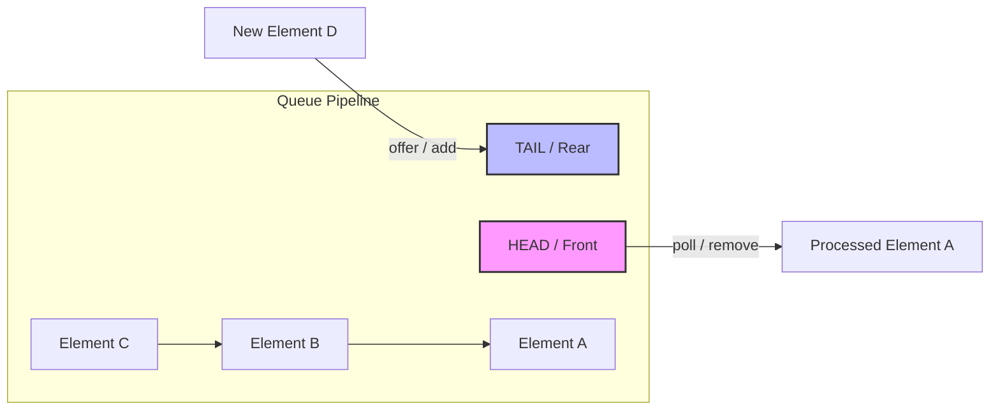
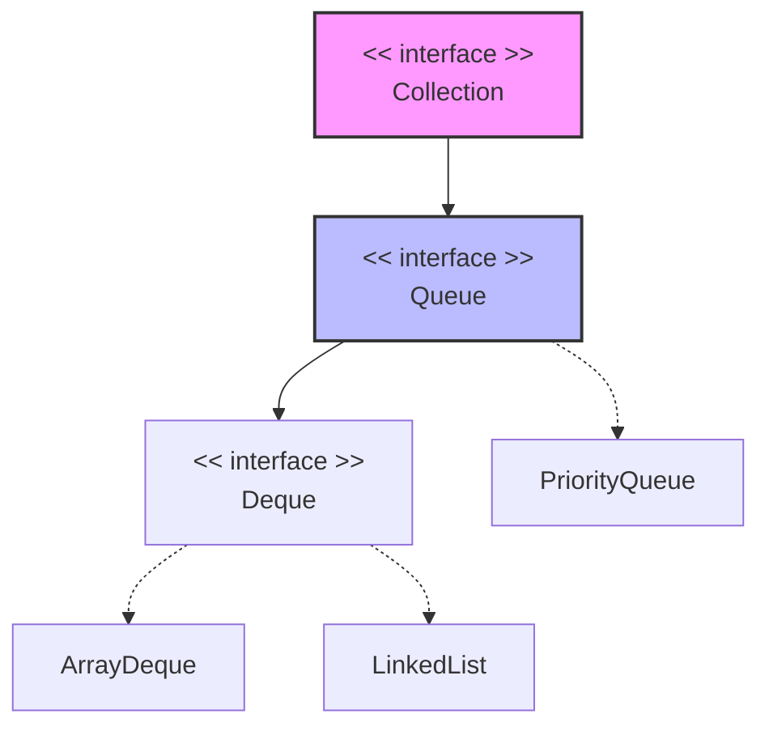

# Java Queue Interface Guide

The `Queue` interface is a core component of the `java.util` package and extends the `Collection` interface. It models a collection designed for holding elements prior to processing, typically ordering elements in a specific sequence.

---

## 1. Core Features
* **FIFO Processing:** By default, standard queues follow a **First-In-First-Out** pattern (except for `PriorityQueue`, which uses natural/custom priority sorting).
* **No Indexed Access:** Elements cannot be accessed directly by a positional index ($O(n)$ positional operations are not supported).
* **Duplicates Allowed:** Unlike sets, queues generally allow duplicate elements to reside in the pipeline.

---

## 2. Queue Pipeline Visualization

The diagram below simplifies how data streams through a standard FIFO queue structure:



---

## 3. Hierarchy & Common Implementations



* **[LinkedList](https://www.geeksforgeeks.org/linked-list-in-java/):** Implements both standard `List` and `Deque` behaviors. Provides standard sequential FIFO queues. Permits `null` objects.
* **[ArrayDeque](https://www.geeksforgeeks.org/arraydeque-in-java/):** A resizable array-backed implementation. Faster than `LinkedList` for queue operations and memory-efficient; does not allow `null` objects.
* **[PriorityQueue](https://www.geeksforgeeks.org/priority-queue-class-in-java/):** Sorts elements by priority (ascending order by default), rather than their entry sequence.

---

## 4. Interface Methods Summary

The `Queue` interface offers two sets of methods for its core operations. One group throws exceptions if an operation fails, while the other returns a special fallback value (like `false` or `null`).

| Operation Type | Throws Exception | Returns Special Value | Behavior Description |
| --- | --- | --- | --- |
| **Insert** | `add(e)` | `offer(e)` | Inserts an element at the tail of the queue. |
| **Remove** | `remove()` | `poll()` | Removes and returns the head of the queue. |
| **Examine** | `element()` | `peek()` | Inspects and returns the head without removing it. |

---

## 5. Comprehensive Practical Example

Below is a clean example showing how to initialize a queue with a `PriorityQueue` implementation:

```java
import java.util.PriorityQueue;
import java.util.Queue;

public class QueueDemo {
    public static void main(String[] args) {
        // 1. Instantiate a PriorityQueue
        Queue<Integer> pq = new PriorityQueue<>();

        // 2. Add elements (PriorityQueue automatically sorts them ascending)
        pq.add(50);
        pq.add(20);
        pq.add(40);
        pq.add(10);

        // 3. Peek at the head element without taking it out
        System.out.println("Head element (peek): " + pq.peek()); // Output: 10

        // 4. Dequeue elements sequentially using poll()
        System.out.print("Processing Queue: ");
        while (!pq.isEmpty()) {
            System.out.print(pq.poll() + " "); // Output order: 10 20 40 50
        }
    }
}

```

> 💡 **Tip:** When programming in multithreaded systems, consider using concurrent variants like `ConcurrentLinkedQueue` or `BlockingQueue` implementations to ensure clean thread synchronization.

```

```