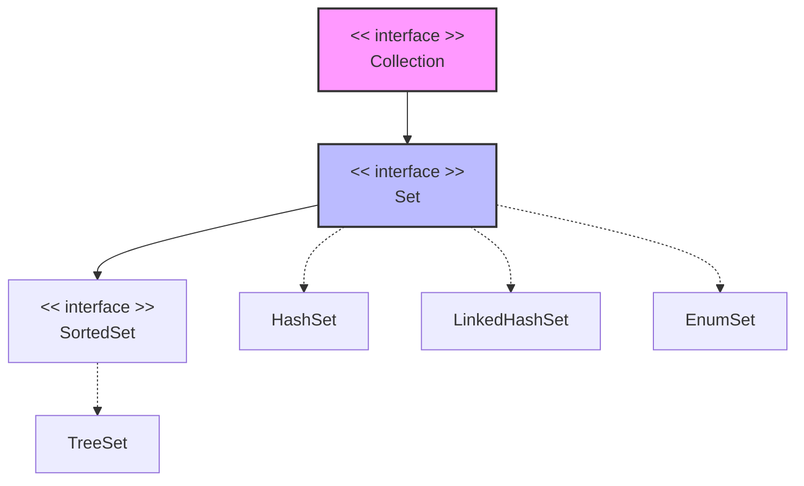

# Java Set Interface Guide

The `Set` interface in Java is a core component of the Java Collection Framework, located in the `java.util` package. It models the mathematical set abstraction and is designed to store collections of unique elements.

---

## 1. Core Features
* **No Duplicates:** A `Set` cannot contain duplicate elements. If you attempt to add an existing element, the operation returns `false` and leaves the set unchanged.
* **Null Elements:** It can contain at most one `null` value (with the exception of `TreeSet`, which does not permit `null` elements due to natural sorting rules).
* **Unordered Sequence:** Unlike a `List`, a basic `Set` does not guarantee any specific iteration order (though certain implementations like `LinkedHashSet` preserve insertion order).

---

## 2. Hierarchy & Implementations

The `Set` interface extends `Collection` and is implemented by several distinct classes, each optimized for different use cases:



* **[HashSet](https://www.geeksforgeeks.org/hashset-in-java/):** Backed by a hash table. It makes no guarantees regarding iteration order and offers constant-time ($O(1)$) performance for core operations.
* **[LinkedHashSet](https://www.google.com/search?q=https://www.geeksforgeeks.org/linkedhashset-in-java/):** A hash table implementation with a running doubly-linked list that reliably maintains elements in the exact order they were inserted.
* **[TreeSet](https://www.geeksforgeeks.org/treeset-in-java/):** Backed by a Red-Black tree structure. Elements are automatically sorted according to their natural ordering or a custom `Comparator`.
* **[EnumSet](https://www.google.com/search?q=https://www.geeksforgeeks.org/enumset-in-java/):** A highly efficient, specialized set implementation designed exclusively for use with Java `enum` types.

---

## 3. Core Interface Methods

| Method | Description |
| --- | --- |
| `add(E element)` | Adds the specified element if it is not already present. Returns `true` if added. |
| `addAll(Collection<? extends E> c)` | Performs a union operation by adding all elements from the targeted collection. |
| `contains(Object o)` | Returns `true` if the set contains the specified target element. |
| `remove(Object o)` | Removes the specified element from the set if it exists. |
| `retainAll(Collection<?> c)` | Performs an intersection operation, keeping only elements present in the target collection. |
| `removeAll(Collection<?> c)` | Performs a set-difference operation, removing all elements present in the target collection. |
| `clear()` | Flushes all elements, leaving the set completely empty. |
| `size()` | Returns the total count of elements currently held in the set. |

---

## 4. Comprehensive Code Implementation

The following Java example demonstrates declaring a type-safe `Set`, adding items, verifying membership, and executing a standard for-each iteration sequence:

```java
import java.util.HashSet;
import java.util.Set;

public class SetDemo {
    public static void main(String[] args) {
        // 1. Initializing a type-safe Set using a HashSet implementation
        Set<String> set = new HashSet<>();

        // 2. Adding unique elements
        set.add("A");
        set.add("B");
        set.add("C");
        set.add("A"); // Duplicate element attempt; will be ignored silently

        // 3. Printing the final collection status
        System.out.println("Set Elements: " + set); // Output order is not guaranteed

        // 4. Verification Check using contains()
        String checkElement = "B";
        System.out.println("Contains '" + checkElement + "'?: " + set.contains(checkElement));

        // 5. Removing an element
        set.remove("C");

        // 6. Sequential traversal using an enhanced for-each loop
        System.out.print("Iterating Set: ");
        for (String value : set) {
            System.out.print(value + " ");
        }
    }
}

```

> 💡 **Tip:** Always declare your collection objects using the interface type (e.g., `Set<String> s = new HashSet<>();`) rather than the concrete class type. This decouples your code implementation, allowing you to seamlessly swap `HashSet` out for a `TreeSet` or `LinkedHashSet` later if requirements change.

```

```