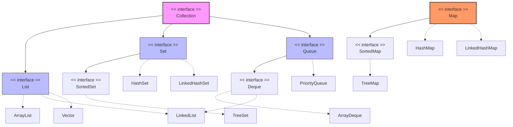

# Java Collection 

---

## Java Collection Framwork (JCF)

**Java Collection Framework (JCF)** is a set of classes and interfaces that provide ready-made data structures to store and manipulate groups of objects efficiently.

1. Classes
2. Interfaces 

Classes  **List, Set, Map, and Queue**
Interfaces **ArrayList, HashSet, HashMap, and PriorityQueue**

1. Increase Productivity
2. Resuability
3. Maintainability
4. Faster

**Features**
1. Provides ready-to-use data structures (e.g., ArrayList, HashSet, HashMap).
2. Offers interfaces (Collection, List, Set, Map, Queue) to define standard behaviors.
3. Supports dynamic resizing, unlike arrays with a fixed size.
4. Includes algorithms (sorting, searching, iteration) via the Collections utility class.
5. Improves code reusability and performance by reducing boilerplate code.

---

## 1. Architecture Hierarchy Diagram

Below is the structural relationship between the core interfaces and their popular implementations in Java:

---

## topics included 
1. Core Interfaces
    - Collection Interface
        * Declaration
        * Sub - Interfaces
        * Operation
    - List Interface
        * Syntax
        * Declaration
        * Operation
        * Methods
        * Final Implementation
    - Queue Interface
    - Dequeue Interface
    - Set Interface
    - Map Interface 

2. List Implemetation

3. Set Implementation 

4. Queue and Dqueue Implementation

5. Map Implementation 

6. Utility and Supporting Classes 

7. Concerrency Collections 

