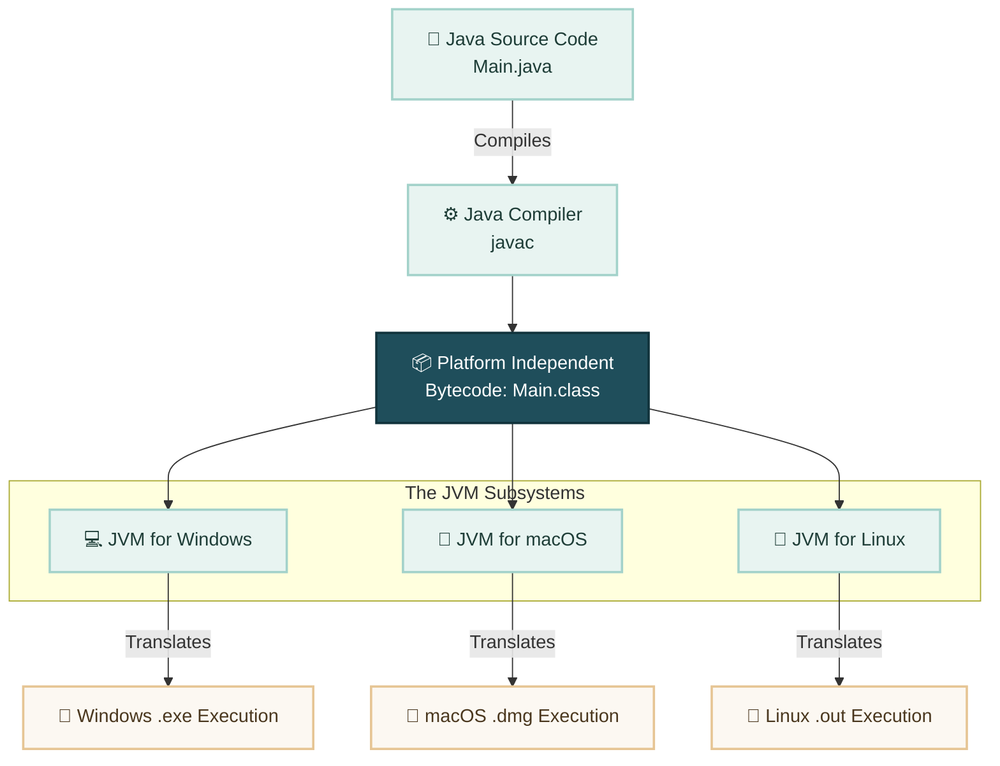

# Question 3: What is JVM (Java Virtual Machine)?

## 📌 Overview
**JVM** stands for **Java Virtual Machine**. It is an abstract computing machine that acts as a Java interpreter. It is responsible for loading, verifying, and executing the generic **Bytecode (`.class` file)** generated by the Java compiler (`javac`).

> **Crucial Interview Note:** While the JVM software itself is **platform-dependent** (different installers are required for Windows, macOS, and Linux), it plays the vital role of making the Java language **platform-independent**.

---

## 🛠️ How JVM Achieves Platform Independence

The diagram below shows how the platform-dependent JVM reads a uniform bytecode file and translates it into native machine code for specific operating systems:

