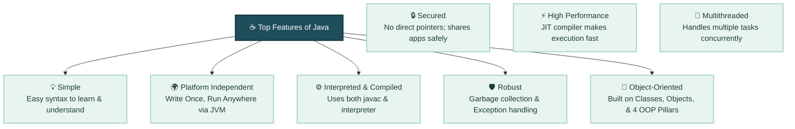

```mermaid
graph TD
    %% Custom Styling
    classDef main fill:#1f4e5b,stroke:#11333c,stroke-width:2px,color:#fff;
    classDef feature fill:#e8f4f1,stroke:#a3d2ca,stroke-width:2px,color:#1e3d37;

    %% Nodes
    Root[☕ Top Features of Java]:::main

    Simple[💡 Simple<br>Easy syntax to learn & understand]:::feature
    PlatInd[🌍 Platform Independent<br>Write Once, Run Anywhere via JVM]:::feature
    Interp[⚙️ Interpreted & Compiled<br>Uses both javac & interpreter]:::feature
    Robust[🛡️ Robust<br>Garbage collection & Exception handling]:::feature
    OOP[🧩 Object-Oriented<br>Built on Classes, Objects, & 4 OOP Pillars]:::feature
    Secured[🔒 Secured<br>No direct pointers; shares apps safely]:::feature
    HiPerf[⚡ High Performance<br>JIT compiler makes execution fast]:::feature
    Multi[🧵 Multithreaded<br>Handles multiple tasks concurrently]:::feature

    %% Connections
    Root --> Simple
    Root --> PlatInd
    Root --> Interp
    Root --> Robust
    Root --> OOP
```
    Root --> Secured
    Root --> HiPerf
    Root --> Multi
